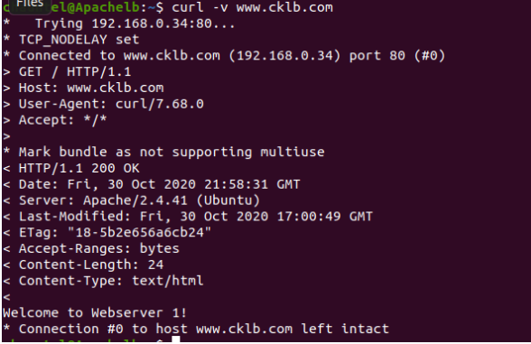
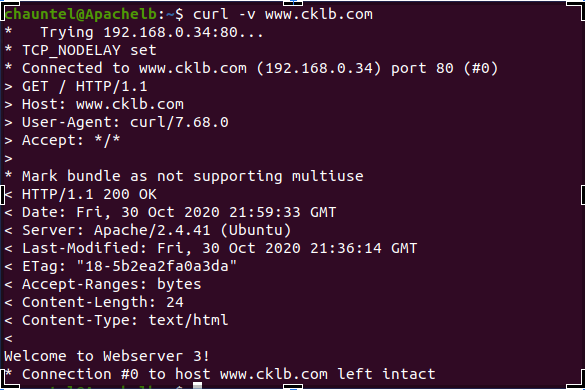

# Apache Load Balancer

Apache-LB - 192.168.1.34

NFS - 192.168.1.178

DB - 192.168.1.120

Web 1 - 192.168.1.117

Web 2 - 192 .168.1.115

Web 3 - 192.168.121

---

## Apache LB Static IP and Network configuration.

1. I set the Apache Load Balancers hostname as apache-lb and added my IP to whitelist private IP range

```bash
sudo hostnamectl set-hostname cklb.com
#Added my known ip to whitelist private IP range
firewall-cmd --permanent --add-source=192.168.1.0/24
```

2. I then set a static IP for the Apache LB

```bash
sudo vi /etc/sysconfig/network

#add below to file
NETWORKING=yes
HOSTNAME=cklb.com
GATEWAY=192.168.1.3
NETWORKING_IPV6=no
IPV6INIT=no
```

3. I then edited ifcfg-enp0s3(corresponding to my NIC)

```bash
sudo vi /etc/sysconfig/network-scripts/ifcfg-enp0s3

#I made the following changes:

DNS1=192.168.1.3
DNS2=8.8.8.8
GATEWAY=192.168.1.3
HOSTNAME=cklb.com
NETMASK=255.255.255.0
IPADDR=192.168.1.31
BOOTPROTO=none
PREFIX=24
DEFROUTE=no
ONBOOT=yes
```

4. I set the hosts record for the webservers

```bash
sudo vi /etc/hosts

#input the following inside the file and save and exit
192.168.1.117 www.cktest1.com Webserver1
192.168.1.115 www.cktest2.com Webserver2
192.168.1.121 www.cktest3.com Webserver 3
192.168.1.34 www.cklb.com Apachelb

```

5. Now apply changes to network configurations.

```bash
sudo nmcli connection down enp0s3 && sudo nmcli connection up enp0s3

output:

Connection 'enp0s3' successfully deactivated (D-Bus active path: /org/freedesktop/NetworkManager/ActiveConnection/1)
Connection successfully activated (D-Bus active path: /org/freedesktop/NetworkManager/ActiveConnection/4)
```

6. Change ports,  if you want the Apache2 HTTP server to sit behind a proxy server, then the proxy server must be configured to listen on default port 80, and the Apache2 HTTP servers must also be configured to a different port than 80, since the two services can't be assigned one port to listen to.

On the webservers 1,2,3 
```bash
sudo vi /etc/httpd/conf/httpd.conf
#Find the lines that read 80 and 443 change to 8080 and 444
Listen 8080
Listen 444
```

```bash
sudo vi /etc/httpd/sites-available/cktest*.com.conf
<VirtualHost*:8080>
    ServerName www.cktest*.com
    ServerAlias cktest*.com
</VirtualHost>
```

7. Add firewall rule on webservers to allow connection on 8080
```bash 
sudo ufw allow 8080
```

## Configuring Apache Load Balancer

1.  Install httpd
```bash 
sudo apt update
sudo intstall apache2
```

2.  Enable apache modules and restart
```bash
sudo a2enmod proxy
sudo a2enmod proxy_http
sudo a2enmod proxy_balancer
sudo a2enmod lbmethod_byrequests
sudo a2enmod headers
sudo systemctl restart apache2
```


3. Define Apache2 load balancer

```bash
sudo vi /etc/apache2/sites-available/000-default.conf
<VirtualHost *:80>
<Proxy balancer://mycluster>
    			BalancerMember http://cktest1.com:8080
    			BalancerMember http://cktest2.com:8080
    			BalancerMember http://cktest3.com:8080
		</Proxy>

    		ProxyPreserveHost On

    		ProxyPass / balancer://mycluster/
    		ProxyPassReverse / balancer://mycluster/
		</VirtualHost>
  ```


## Test that you can access all the webservers through the load balancer's DNS name 

1. I used tail-f command to see the access log on all 3 webservers

```bash
tail -f /var/log/httpd/access_log
```

2.  On the apache LB i used the curl command to see the response to the DNS name

Webserver 1 test <br>


Webserver 3 test <br>


